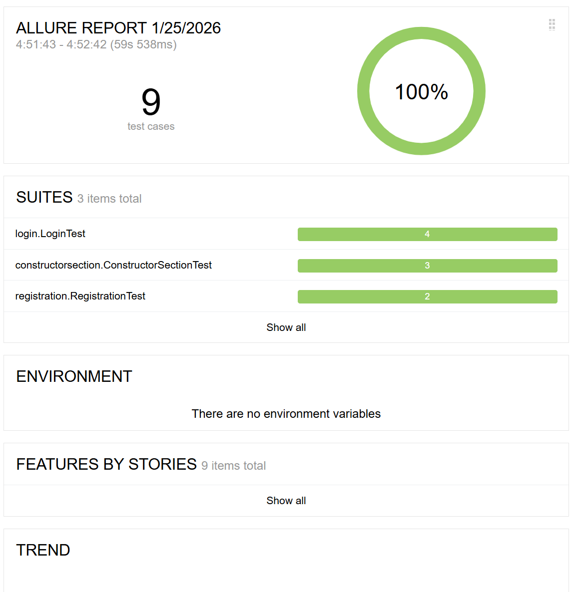
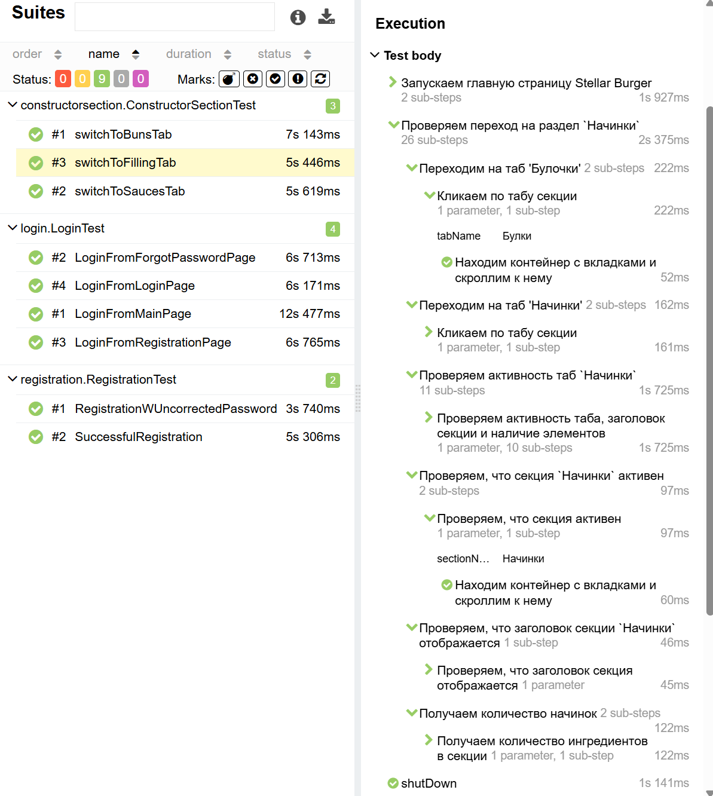
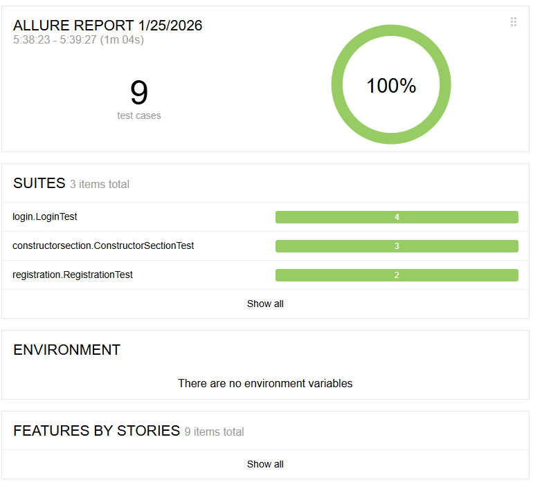
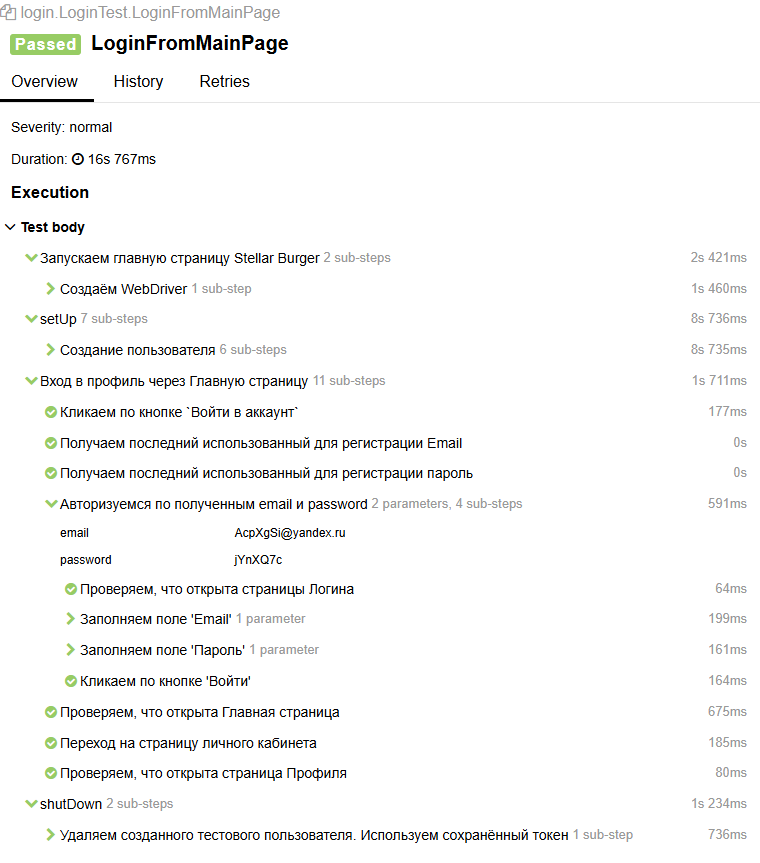

# Дипломная работа. Задание 3: Тестирование UI

Нужно написать UI автотесты для сервиса создания бургеров [Stellar Burgers](https://stellarburgers.education-services.ru/).  

В тестах также используются API запросы. [Документация](https://code.s3.yandex.net/qa-automation-engineer/python-full/diploma/Api-Stellar_Burgers.pdf) к API.

Используемые в тестах элементы нужно описать с помощью Page Object.

Функциональность должна быть протестирована в браузерах:
- Google Chrome;
- Яндекс Браузере.

К тестам необходимо подключить Allure-отчёт.

## Необходимо протестировать следующее:
### Регистрация
Проверить:
- Успешную регистрацию.
- Ошибку для некорректного пароля. Минимальный пароль — 6 символов.

### Вход
Проверить:
- вход по кнопке «Войти в аккаунт» на главной; 
- вход через кнопку «Личный кабинет»; 
- вход через кнопку в форме регистрации; 
- вход через кнопку в форме восстановления пароля.

### Раздел «Конструктор»
Проверить, что работают переходы к разделам:
- «Булки»; 
- «Соусы»; 
- «Начинки».

## Использовала
- JUnit 4
- Allure
- RestAssured
- XPath
- Page Object
- Selenium
- Windows 11 Pro

## Сделала
- 5 POJO класса
- 3 тестовых класса

[//]: # (- 5 вспомогательных класса, в которые вынесена основная логика тестов, что позволило избежать большого количества дублирования кода.)

- Все методы имеют аннотацию Step, чтобы тесты можно было просмотреть по шагам, а все запросы и ответы к API логируются.
- Все тестовые данные генерируются рандомно

## Результат прохождения тестов

### Google Chrome

Пример шагов:


### Yandex Browser

Пример шагов:


## Запуск тестов
Тесты для **разных браузеров** запускаются **отдельно** и **требуют наличия соответствующего браузера** на компьютере.  
Для запуска тестов для соответствующего браузера выполните:
```bash
mvn clean test -Dbrowser=chrome
mvn clean test -Dbrowser=yandex
```

## Просмотр результатов Allure
В репозитории лежат результаты Allure. Чтобы их просмотреть, запустите:
```
mvn allure:serve
```